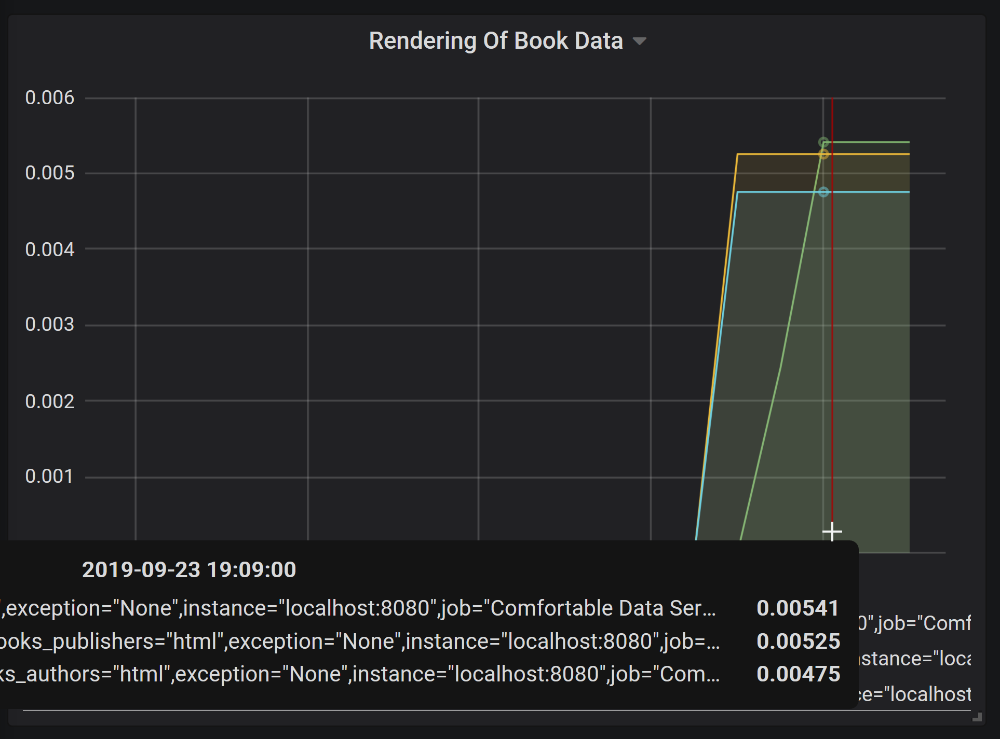

# Welcome to the monitoring documentation


## Steps to enable monitoring with Spring Boot

In your pom.xml you should add the **actuator** dependency.
The **actuator** framework does use **Micrometer** for metrics
which supports a bunch of monitoring systems.

My personal choice was to use Prometheus in combination with Grafana;
for adding Prometheus you need to have those second dependency.

```
<dependency>
	<groupId>org.springframework.boot</groupId>
	<artifactId>spring-boot-starter-actuator</artifactId>
	<version>${spring.boot.version}</version>
</dependency>

<dependency>
	<groupId>io.micrometer</groupId>
	<artifactId>micrometer-registry-prometheus</artifactId>
	<version>${micrometer.version}</version>
</dependency>
```

In your **appliction.properties** you should define at least something
like following:

```
# actuator configuration
info.app.name=Comfortable Data Service
info.app.description=Managing Books and Movie Data in a comfortable way
info.java.version=@java.version@

management.endpoints.web.exposure.include=health,info,metrics,prometheus
management.endpoint.health.show-details=always
```

The default is to have the endpoints **health** and **info** only.
The **metrics** is a good choice to quickly verify a metric while the **prometheus**
endpoint comes with the mentioned dependency.

Please also have a look at my pom.xml on how to use the spring boot maven plugin
for the goal "build-info" which provides build information at the **info** endpoint

In the code you basically just have to place annotations like **@Timed**:

```
@PostMapping(value = "/books", produces = {
	CustomMediaType.APPLICATION_JSON_VALUE, CustomMediaType.APPLICATION_XML_VALUE,
	CustomMediaType.APPLICATION_YAML_VALUE, CustomMediaType.APPLICATION_MSGPACK_VALUE})
@Timed(value = "books.create.or.update", extraTags = {"books", "create.or.update"})
public Book createOrUpdateBook(@RequestBody final Book book) {
	return this.repository.save(book);
}
```

## Why I preferred Prometheus and Grafana

There are several reasons (no order):

 - it is **free**
 - it is **easy**
 - the **metrics names remain readable** (in opposite to Graphite)
 - the **metrics are pulled** by Prometheus/Grafana **when needed**

## Configuration of Prometheus

You basically download Prometheus and unpack the tar.gz (the Windows version in my case).
In same folder where the **prometheus.exe** resides I have created following file **prometheus.yml**:

```
global:
  scrape_interval:     15s # By default, scrape targets every 15 seconds.

scrape_configs:
  - job_name: 'Comfortable Data Service'

    # Override the global default and scrape targets from this job every 5 seconds.
    scrape_interval: 5s
    metrics_path: /actuator/prometheus

    static_configs:
      - targets: ['localhost:8080']
```
`
You simple start the **prometheus.exe** and that's all.


## How it looks like in Grafana

There is an installer for Windows you can download from Grafana Homepage. Very easy.
The initial login is **admin/admin** and you have to select as **data source** the
Prometheus endpoint which is already offered to you if you stick to the standard setup.

Creating a graph is also very easy.




## Links

 - https://grafana.com/get
 - https://prometheus.io/download/

